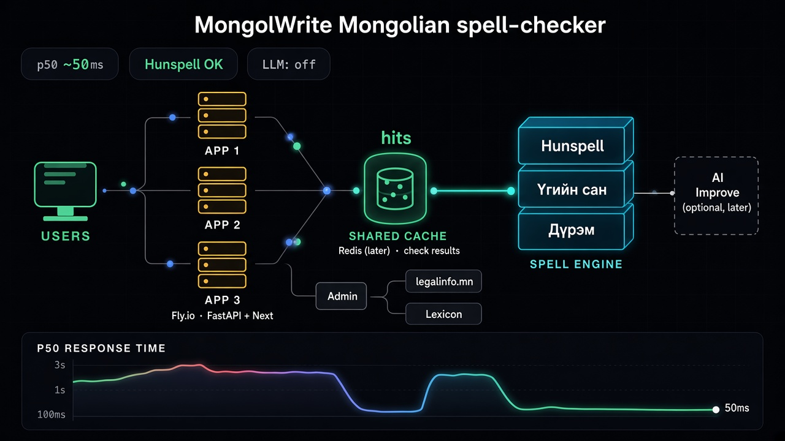

# MongolWrite AI — Architecture

Mongolian Grammarly-style writing assistant for official and institutional documents.

This document is the source of truth. V1 is built to this spec without per-phase confirmation.

## 1. Product

**Name:** MongolWrite AI

**Goal:** Detect spelling, punctuation, grammar, style, and official-writing issues in Mongolian Cyrillic text. Underline in the editor, explain, and apply one-click fixes.

**V1 scope (ship):**

- Web editor (TipTap)
- Deterministic Mongolian engine (dictionary + rules)
- Inline highlights + suggestion sidebar
- Accept / reject / ignore / personal dictionary
- Document type + style stored on the document
- Autosave + version history
- Email/password auth
- Organization tenant (personal org on signup)
- Latin/Cyrillic homoglyph and mixed-script detection
- Dictionary-backed о↔ө and у↔ү suggestions (the dominant Mongolian typing errors)
- Copy corrected text (Word/paste workflow until the add-in exists)

**Out of V1:**

- Live LLM checking and rewrite (stub + HTTP 501)
- Word add-in, Chrome extension
- Organization terminology CSV
- Billing
- Invented legal templates

## 1.1 What we add beyond the ChatGPT spec

ChatGPT’s list is a full SaaS roadmap, not a V1. These are the product gaps we actually fill; we do not add Word/Chrome/billing until the web editor is real.

1. **Latin/Cyrillic homoglyphs** — `a/е/o/p/c/x` typed on an English keyboard inside Mongolian words. This is one of the most common real errors and was missing from the spec.
2. **о↔ө and у↔ү suggestions** — only when a dictionary hit exists after the swap. No blind replacement.
3. **Copy / paste-out** — government users live in Word. Until an add-in exists, one-click copy of the current text is required.
4. **Guest check** — typing in the editor checks immediately (rate-limited). Saving a document requires an account.

We still will not invent grammar, legal templates, or pretend AI.

## 2. Principles

1. Do not rely on an LLM as the source of Mongolian grammar truth.
2. Do not send document text to any AI provider unless the user explicitly clicks Improve (V2).
3. Do not invent linguistic rules. Uncertain rules are `TODO`.
4. Do not invent facts, dates, names, numbers, or legal references in any rewrite.
5. Do not treat Mongolian Cyrillic as Russian. Never fold `ө/ү` into `о/у`.
6. Do not fake features. Unimplemented endpoints return 501 and are marked TODO.

## 3. Tech stack

| Layer | Choice |
| --- | --- |
| Frontend | Next.js (App Router), TypeScript, React, Tailwind CSS, shadcn/ui, TipTap |
| Backend | Python, FastAPI, Pydantic v2, SQLAlchemy 2 (async) |
| Database | PostgreSQL 16 |
| Cache / rate limit | Redis 7 |
| Auth (web) | httpOnly cookie session, Argon2id passwords, CSRF |
| Auth (add-ins, later) | JWT against the same API |
| AI (V2) | `AIProvider` interface; first adapter OpenAI |
| Local run | Docker Compose |
| Dictionary | Hunspell-compatible interface + bundled public wordlist |

Frontend contains no business language rules except debounce and offset mapping.

## 4. System architecture



```
USERS
  │
  ▼
APP 1 … APP N     (Fly.io · FastAPI + Next · CHECK_CONCURRENCY)
  │
  ├── Shared cache (optional Redis L2 · always memory L1)
  │         │
  │         ▼
  └── SPELL ENGINE
        ├── Hunspell (~621k stems)     ← acceptance
        ├── Үгийн сан (curated seed)   ← suggestions / admin
        └── Дүрэм (harmony, …)

Admin ── legalinfo.mn / lexicon export

AI Improve = optional later (LLM off by default)
```

**Production today (single machine is fine):**

- 1 Fly machine + persist volume; Redis optional (`REDIS_URL`)
- Hunspell membership: process L1 cache → optional Redis → `.lookup()`
- Concurrent checks via `CHECK_CONCURRENCY` (default 3) instead of a global lock
- LLM is not on the hot path

**Check flow:**

1. Editor debounces ~500ms.
2. `POST /api/v1/check/deterministic` with UTF-8 text.
3. Engine returns `Correction[]` with Unicode code-point offsets.
4. Frontend maps offsets onto TipTap decorations.
5. Optional later: Improve action may call AI — never the default spell path.
6. Ranker drops AI suggestions that contradict high-confidence dictionary hits.

**Scale-out when traffic grows:**

1. Raise `min_machines_running` / add machines (note: Fly volume is single-writer — prefer Redis for shared Hunspell cache before multi-writer admin state).
2. Set `REDIS_URL` (Upstash / Fly Redis) for cross-instance Hunspell membership.
3. Watch admin «Сайтын төлөв» → cache hit% / p50.
## 5. Folder structure

```
/frontend                 Next.js app
/backend                  FastAPI app
/backend/app/engine       Pure Mongolian language engine
/backend/app/ai           AIProvider (stub in V1)
/infrastructure           Docker Compose
/docs                     Architecture and runbooks
/tests                    Cross-cutting e2e
/data                     Public wordlists and rule YAML (no private documents)
/word-addin               V3 placeholder
/extension                V3 placeholder
```

OpenAPI from FastAPI is the shared contract. Do not duplicate models by hand in two languages without codegen.

## 6. Database

UUID primary keys. `timestamptz` `created_at` / `updated_at`. `organization_id` on every tenant-scoped row. Soft delete on documents and dictionary words; hard delete for retention.

**V1 tables:** `users`, `organizations`, `organization_members`, `documents`, `document_versions`, `corrections`, `dictionaries`, `dictionary_words`, `grammar_rules`, `spelling_rules`, `style_rules`, `usage_records`, `audit_logs`, `subscriptions` (schema only, FREE plan hardcoded).

**Later tables:** `organization_terms` (V4), `ai_requests` / `ai_responses` (V2; do not store full document text by default).

Every repository method takes `organization_id`. No unscoped queries.

## 7. API

Base path: `/api/v1`. UTF-8 JSON. Offsets: inclusive start, exclusive end, Unicode code points into the submitted plain text.

| Area | Endpoints | When |
| --- | --- | --- |
| Auth | `POST /auth/register`, `/login`, `/logout` | Phase 1–2 |
| Documents | CRUD + versions | Phase 2 |
| Check | `POST /check/deterministic` and thin wrappers | Phase 3 |
| AI | `/check/ai`, `/rewrite/*` | 501 until V2 |
| Dictionary | user dictionary CRUD | Phase 3 |
| Org terms | `/organization/terms` | 501 until V4 |

### Correction object

```
id, category, original_text, suggested_text, explanation,
confidence (0–1), start, end, source (RULE | DICTIONARY | AI),
rule_id, severity (error | warning | suggestion)
```

**Categories:** `SPELLING`, `GRAMMAR`, `PUNCTUATION`, `WORD_CHOICE`, `STYLE`, `FORMALITY`, `CLARITY`, `REDUNDANCY`, `TERMINOLOGY`, `AI_REWRITE`.

## 8. Mongolian language engine

Hybrid pipeline. Layers 1–5 and 7 are deterministic. Layer 6 is LLM (V2).

1. `TextNormalizer` — NFC only, never NFKC; preserve `ө ү Ө Ү`
2. `Tokenizer`
3. `SentenceSegmenter`
4. `DictionaryChecker` — Hunspell-compatible, replaceable
5. `MorphologyAnalyzer` — interface; stub in V1, no invented affixes
6. `SpellingChecker`
7. `PunctuationChecker`
8. `GrammarRuleEngine`
9. `StyleRuleEngine`
10. `TerminologyChecker`
11. `CorrectionRanker`

**V1 rules we will actually implement:**

- Mongolian Cyrillic character validation including ө/ү
- Whitespace
- Repeated words
- Repeated punctuation
- Basic comma/space punctuation
- Unknown-word vs dictionary + user dictionary
- Vowel harmony for question/directive particles (уу/үү, бэ/вэ, руу/рүү)
- Case-suffix harmony (аас/ээс/оос/өөс, ын/ийн, тай/тэй/той) when the corrected form is in the dictionary
- Negation -гүй, ь + dative -д
- Separate writing of auxiliaries and question particles
- Documented common-misspelling list (`data/common_misspellings.txt`)
- Conservative official-style flags; uncertain rules stay unused

Phase 3 requires at least 100 Mongolian unit tests. Morphology and commercial spellers (Bolor) are integration points, not V1 dependencies.

## 9. AI (V2)

Interface: `AIProvider` with `check_text`, `rewrite_text`, `explain_correction`, `classify_document`, `analyze_style`.

First implementation: `OpenAIProvider`. Credentials from environment only. Responses must be strict JSON; invalid JSON retries once then errors. Token usage tracked without logging document bodies.

**Prompt constraints:** never invent or change names, numbers, dates, organization names, document numbers, citations, quotations. Prefer concise official Mongolian. Classify definite / probable / stylistic. Only definite errors may be auto-applied (auto-apply remains off in V1).

Hallucination example to reject: adding a date that was not in “Шинжилгээний хариу ирүүлсэн болно.”

## 10. Editor

TipTap. Original visual design; Grammarly-like interaction.

- Left: new document, documents, templates (stub), dictionary, settings
- Center: title, type, style, editor, counts, autosave, Improve (disabled V1)
- Right: category filters, counts, explanation, Засах / Алгасах / Тольд нэмэх

UI copy is Mongolian. Debounce 500ms. Deterministic check only in V1. Positions mapped from Unicode code points to ProseMirror positions in one module.

Word add-in (Office.js) and Chrome MV3 talk only to this backend. No API keys in clients. Password fields never captured.

## 11. Security

Assume documents may be sensitive official text.

- TLS in production
- Argon2id, httpOnly Secure cookies, SameSite=Lax, CSRF on mutations
- Tenant isolation in repositories
- Redis rate limits on check endpoints
- Max document size
- Secrets only in env; `.env.example` empty
- Never log document bodies or put them in exception messages
- Permanent delete of document + versions
- Audit metadata only (login, delete) — no body

## 12. Testing and deployment

- Pytest: engine + API
- Playwright: editor happy path
- Engine regression set (precision/recall seed in V1)
- Docker Compose: API, Next.js, Postgres, Redis
- Production deploy is a later milestone; no fake “production-ready” claim in V1

## 13. Roadmap

| Phase | Work | Version |
| --- | --- | --- |
| 0 | Architecture | now |
| 1 | Monorepo, Docker, env, health | V1 |
| 2 | Models, Alembic, auth, documents | V1 |
| 3 | Deterministic engine + 100 tests | V1 |
| 4 | AI provider stub (501) | V1 stub / V2 live |
| 5 | TipTap + highlights + sidebar | V1 |
| 6 | AI Improve UI | V2 |
| 7 | Templates (structure only) | V2 |
| 8 | Org terminology | V4 |
| 9–10 | Word + Chrome | V3 |
| 11–12 | Public dataset + eval | parallel / V1 seed |
| 13 | Dashboard | V4 |
| 14 | Subscription interfaces, no payments | V5 |
| 15 | Security audit + production review | before real users |

## 14. Confirmation gate

Next implementation step is **Phase 1 only**: folder tree, Docker Compose, `.env.example`, README, FastAPI health, Next.js shell. No AI keys. No fake checkers.
